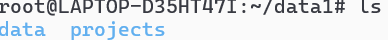
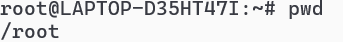

Here’s a **ready-to-use Markdown (`.md`) file** for the commands `cd`, `cp`, `mkdir`, `touch`, `ls`, and `pwd` — including an example of moving one file to another directory.

---

````markdown
# Linux Commands: cd, cp, mkdir, touch, ls, pwd

This document explains basic Linux commands with examples, including moving a file to another directory.

---
````

## 📂 1. `cd` – Change Directory
**Usage:** Move between directories.  

**Syntax:**
```bash
cd directory_name
```

**Example:**


Moves into the `data1` directory.

---

## 📋 2. `cp` – Copy Files or Directories

**Usage:** Copy files or directories from one place to another.

**Syntax:**

```bash
cp source_file destination
```

**Example:**


Creates a copy of `data.txt` named `projects.txt` in the current directory.

---

## 📁 3. `mkdir` – Make Directory

**Usage:** Create a new folder.

**Syntax:**

```bash
mkdir folder_name
```

**Example:**


Creates a directory called `data`.

---

## 📝 4. `touch` – Create an Empty File

**Usage:** Create an empty file or update the timestamp of an existing file.

**Syntax:**

```bash
touch filename
```

**Example:**


Creates an empty file named `data.txt`.

---

## 📜 5. `ls` – List Files and Directories

**Usage:** Display files and folders in the current directory.

**Syntax:**

```bash
ls
```

**Example:**



Lists all files and directories in the current location.

---

## 📍 6. `pwd` – Print Working Directory

**Usage:** Show the full path of the current directory.

**Syntax:**

```bash
pwd
```

**Example:**



Might output:

```
/home/user/Documents
```

---

## 🔄 Combined Example – Moving a File to Another Directory

**Goal:** Create a file, make a new directory, and move the file there.

```bash
touch myfile.txt        # Create an empty file
mkdir myfolder          # Create a new folder
cp myfile.txt myfolder/ # Copy the file into the folder
cd myfolder             # Move into the folder
ls                      # Verify the file is there
pwd                     # Show current directory path
```


