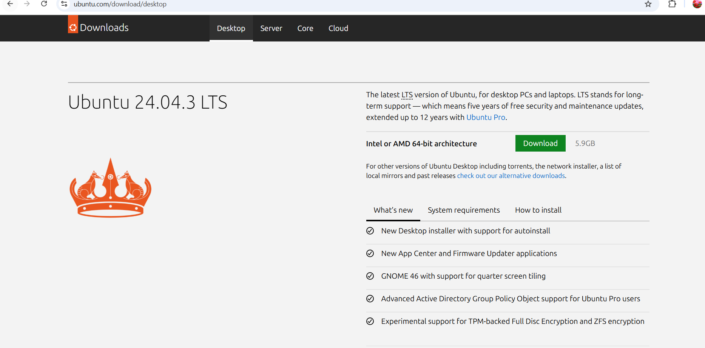

# LAB-0  – Linux Installation and Setup

This experiment covers installing **VirtualBox**, setting up **Ubuntu** inside it, installing **Visual Studio Code** on Ubuntu,running few usual commands.

---
## 1. Installation Method
Chosen Method: **Option A – Virtual Machine**  

## 2. Installation Steps

## 1️⃣ Install VirtualBox
1. Download VirtualBox from the official site:  
   [https://www.virtualbox.org/wiki/Downloads](https://www.virtualbox.org/wiki/Downloads)  
2. Choose **Windows hosts**.  
3. Run the installer and follow default settings.  

---

## 2️⃣ Download Ubuntu ISO
1. Visit: [https://ubuntu.com/download/desktop](https://ubuntu.com/download/desktop)  
2. Select **Ubuntu 22.04 LTS** and download the `.iso` file.  

---

## 3️⃣ Install VS Code in Ubuntu
1. In Ubuntu, open **Firefox** (default browser).  
2. Go to: [https://code.visualstudio.com/Download](https://code.visualstudio.com/Download)  
3. Download the **.deb** package for Debian/Ubuntu.  
4. Double-click the `.deb` file → Install via Ubuntu Software.  
5. Launch **VS Code** from the Applications menu.

---

## 5️⃣ Final Setup
- You can now use VS Code inside Ubuntu for coding.  
- Enable **full-screen mode** in VirtualBox for a better experience.  

---

✅ **You have successfully set up VirtualBox, Ubuntu, and VS Code!**

---
## 3. Terminal Outputs

## 1️⃣ lsb_release -a
The command lsb_release -a displays information about the Linux distribution you are running.

lsb_release = Linux Standard Base release.

-a option = shows all available details.

It typically outputs:

- Distributor ID (e.g., Ubuntu, Debian)

- Description (full name of the OS + version)

- Release (version number, e.g., 22.04)

- Codename (e.g., jammy, focal)

### Sample Output:

## 2️⃣ $ uname -a
The command uname -a prints detailed system information about the Linux kernel and machine.

uname = Unix Name

-a option = shows all available details.

It typically outputs:

- Kernel name (e.g., Linux)

- Hostname of the machine

- Kernel release (version number)

- Kernel version (build details)

- Machine hardware name (e.g., x86_64)

- Processor type

- Hardware platform

- Operating system

## Sample Output:

## 3️⃣  df -h
The command df -h displays the disk space usage of all mounted file systems.

df = disk free

-h option = human-readable format (sizes shown in KB, MB, GB instead of raw blocks).

It typically shows:

- Filesystem name (e.g., /dev/sda1)

- Size of the partition

- Used space

- Available space

- Percentage of usage

- Mount point (where the filesystem is attached, e.g., / or /home)

### Sample Output:
!

## 4️⃣ free -m
The command free -m displays the system’s memory (RAM and swap) usage in megabytes.

free = shows memory usage summary.

-m option = presents values in MB (megabytes).

It typically shows:

- **total**: total installed RAM

- **used**: RAM currently in use

- **free**: unused RAM

- **shared**: memory used by tmpfs/shmem

- **buff/cache**: memory used for disk caching

- **available**: RAM available for starting new applications

- **swap**: usage of swap space (virtual memory)

### Sample Output:

---

## 4. Reflection

During installation, the main challenges I faced were:

- Setting up VirtualBox guest additions.

- Configuring correct RAM and disk size.

- Enabling virtualization in BIOS.

---

## 5. Extra Questions

**Q1.** What are two advantages of installing Ubuntu in VirtualBox?

- Can run Ubuntu without affecting existing OS.

- Easy to take snapshots and revert to earlier states.

**Q2.** What are two advantages of dual booting instead of using a VM?

- Better performance (uses hardware directly).

- Access to full system resources (RAM, GPU, disk).b