# LAB1 – Linux Basics 
This document summarizes commands executed from Lab3 and Lab5 in Unit-1, along with sample outputs and brief explanations.

## File Permissions and Ownership
### Command : `ls -la`
```bash
ls -la
Output: -rwxr-xr--
```
**Explanation:**     
- ls → Lists directory contents  
- -l → Long format: shows permissions, ownership, size, and modification date  
- -a → Includes hidden files (those starting with .  

**Code Snippet:**  

---

### Command : `chmod` 
-used to modify access permissions for files and directories

**Basic Syntax:**

```bash
chmod 741 file.txt
chmod u+x file.txt
```

- `r` → Read (numeric value: 4)   
- `w` → Write (numeric value: 2)  
- `x` → Execute (numeric value: 1)  

**Explanation:**

- `7` → User: read, write, execute  
- `4` → Group: read only  
- `1` → Others: execute only  


### Numeric method:
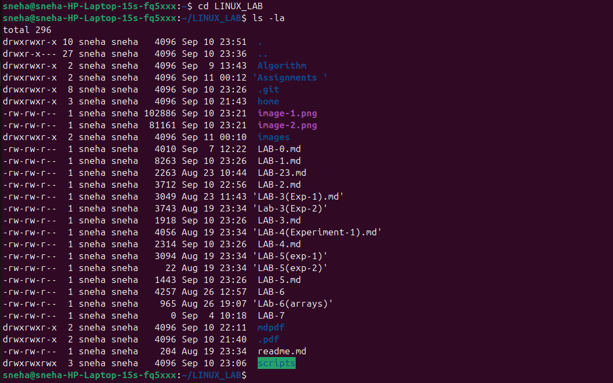

### Recursive Permission Changes

-Apply changes to all files and subdirectories.

```bash
chmod -R 755 /mydir
```

- `-R` → Recursive flag

**Code Snippet:**  
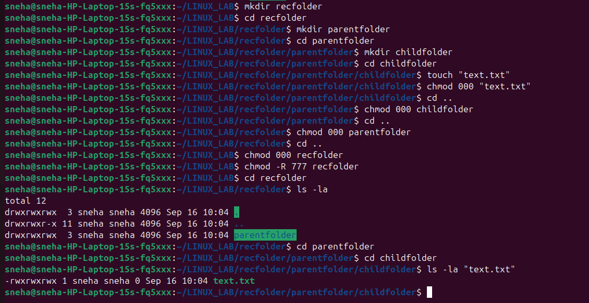
### Command : `chown`
-Changes File Ownership.
### Example:

```bash
chown newon:group2 data.txt
```

**Explanation:**  
Assigns ownership of `data.txt` to user `newon` and group `group2`.
**Code Snippet:**  
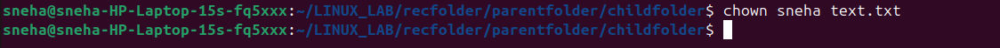

### Applying All Concepts Together

```bash
chmod 700 project.sh         # Full access for user only  
chmod u+x,g-w project.sh     # Add execute for user, remove write for group  
chown root:admin project.sh  # Change owner to root and group to admin
```
**Code Snippet:**  
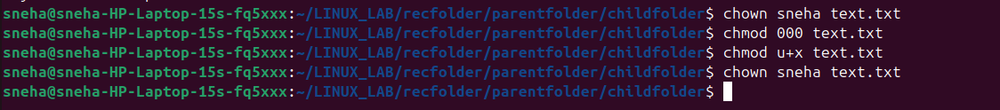
---


##Shell Scripting Basics

# Shell Scripting

Shell scripting is the process of writing a series of commands for the shell (a command-line interpreter) to execute. It's commonly used in Unix/Linux environments for automating tasks.

---
# 🔧What is a Shell?
A shell is a program that takes commands from the user and gives them to the operating system to execute basically  The most common shells include:
- **`bash`** (Bourne Again SHell) – most common

- **`sh`** (Bourne shell)

- **`zsh`** (Z shell)

- **`csh`** (C shell)
---
# 📜 What is a Shell Script?

A shell script is a text file containing a sequence of shell commands. It usually has a .sh extension.

Example: **`first_script.sh`**
```
#!/bin/bash
echo "Hello, world!"
```
---
# 🔧 Steps to Create and Run a Shell Script in Linux
 
 1- Check the current working directory:
 ```
pwd 
 ```
 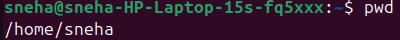

 2-Create a new folder named **`scripts`**:
 ```
 mkdir scripts
 ```
 

 3-Navigate into the **`scripts`** directory:
 ```
 cd scripts
 ```
 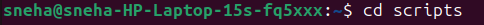

 4- Create a new shell script file named **`first_script.sh`**:
 ```
 touch first_script.sh
 ```
 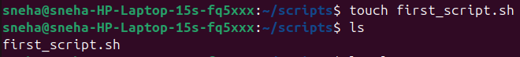

 5-Open the script file using **`nano`** editor:
 ```
 nano first_script.sh
 ```
 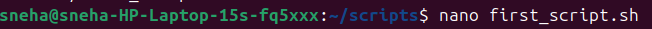

 6-Inside **`nano`**, write the commands you want the script to execute.

 For example,


 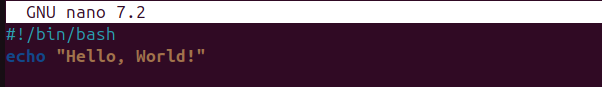
 
 7- Save and exit the editor:

- Press Ctrl + X

- Press Y to confirm saving

- Press Enter to finalize

8- Give execute permission to the script:
``` 
chmod +x first_script.sh
```

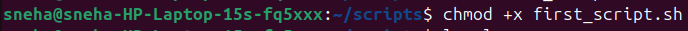

9- Run the script:
```
./first_script.sh
```
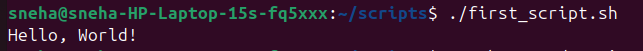

---

# 📝 Variables

Store values inside names!

```bash
name="Sneha"
age=18
echo "Hi, I'm $name and I'm $age years old."
```
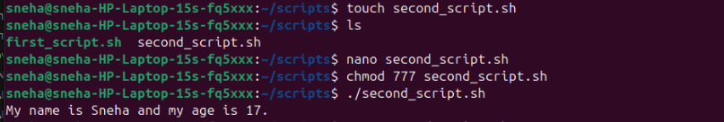

⚡ Tip: No spaces around `=`

---

# 🎤 User Input

```bash
echo "Enter your fav subject:"
read subject
echo "You chose $subject "
```
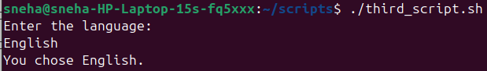
---

# ⚖️ If–Else 

```bash
num=10
if [ $num -gt 5 ]; then
  echo "Bigger than 5 "
else
  echo "Smaller or equal "
fi
```
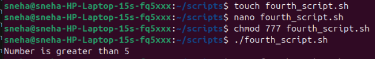

🧾 Common operators:

* `-eq` equal
* `-ne` not equal
* `-gt` greater
* `-lt` less

---

# 🔁 Loops 

🔹 **For Loop**

```bash
for i in {1..3}
do
  echo "Round $i 🌀"
done
```

🔹 **While Loop**

```bash
count=1
while [ $count -le 3 ]
do
  echo "Count = $count"
  ((count++))
done
```
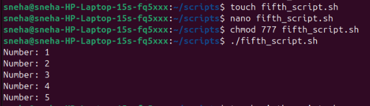
---

# 🔧 Functions 

```bash
greet() {
  echo "Hello, $1 👋"
}

greet "Sneha"
greet "World"
```
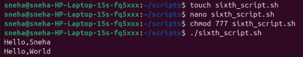
---

# 💡 Command Line Arguments 

```bash
#!/bin/bash
echo "Script: $0"
echo "First: $1"
echo "Second: $2"
```

Run:

```bash
./test.sh apple banana
```

Output:

```
Script: ./test.sh
First: apple
Second: banana
```
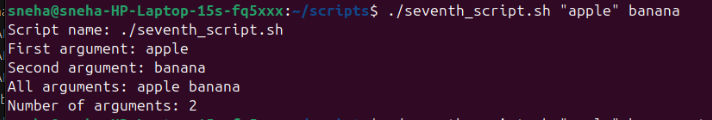


---

# 🍎🍌🍒 Arrays 

```bash
fruits=("apple" "banana" "cherry")
echo "First fruit: ${fruits[0]}"

for f in "${fruits[@]}"; do
  echo "Fruit: $f"
done
```
OUTPUT:


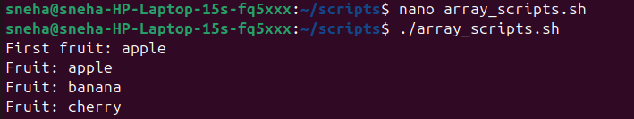

---

# Useful Commands 🛠️

* `date` → 📅 current time
* `whoami` → 🙋 current user
* `ls` → 📂 list files
* `pwd` → 📍 working directory
* `cat file.txt` → 📖 show file

---

# Mini Project 🌟 – Auto Backup

```bash
#!/bin/bash
backup="/tmp/backup_$(date +%H%M).tar.gz"
tar -czf $backup $HOME
echo "Backup saved at $backup ✅"
```

---

# 📒 Cheat Sheet (Quick Recall)

| Feature | Syntax            | Example           |
| ------- | ----------------- | ----------------- |
| Print   | `echo`            | `echo "Hi"`       |
| Var     | `var=value`       | `x=10`            |
| Input   | `read var`        | `read name`       |
| If      | `if [ cond ]`     | `if [ $x -gt 5 ]` |
| For     | `for i in {1..5}` | `echo $i`         |
| While   | `while [ cond ]`  | `((count++))`     |

---


# Extra Questions:  
1. What is the Difference Between `chmod` and `chown`?  

| Command   | Function                                 | Affects                       |
|-----------|------------------------------------------|-------------------------------|
| `chmod`   | Modifies file or directory permissions   | Who can read/write/execute    |
| `chown`   | Changes file or directory ownership      | Who owns the file and group   |

- `chmod` controls **access rights** (read, write, execute).  
- `chown` controls **ownership** (user and group).  

---

2. How to Check Current Directory and User?  

--> To check your current working directory:  

```bash
pwd
```

**Output:** Displays the full path of your present location in the filesystem.  

--> To check your current user:  

```bash
whoami
```

**Output:** Displays the username of the currently logged-in user.  

---
