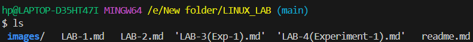

A simple walkthrough of core command-line tools compatible with Linux, macOS, and Git Bash on Windows—handy for browsing directories and handling files directly from the terminal.

---

## ➡️ 1. **Navigation Commands**

### ↪`pwd` – Print Working Directory

Shows the current location in the filesystem.

```bash
pwd
```

📌Syntax:
```
/Users/yourname/projects
```
📌 Output example:


---
### ↪`ls` – List Directory Contents

Lists files and folders in the current directory.

```bash
ls
```
📌 Output example:



### 1️⃣`ls -l` → Detailed list (permissions, size, date)

```bash
ls -l
```
📌 Output example:


### 2️⃣`ls -a` → Shows hidden files (those starting with `.`)

```bash
ls -a
```

📌 Output example:


### 3️⃣`ls -la` → Combined

```bash
ls -la
```

📌 Output example:


---
### ↪`cd` – Change Directory

Moves into a directory.

```bash
cd folder_name
```


Examples:

```bash
cd Documents        # Go to Documents
cd ..               # Go up one level
cd /                # Go to root
cd ~                # Go to home directory
```
---
## ➡️2. **File and Directory Management**

### ↪`mkdir` – Make Directory

Creates a new folder.

```bash
mkdir new_folder
`


---

### ↪`touch` – Create File

Creates an empty file.

```bash
touch file.txt
```


---

### ↪`cp` – Copy Files or Directories

```bash
cp source.txt destination.txt
```

* Copy folder:

```bash
cp -r folder1 folder2
```

---

### ↪`mv` – Move or Rename Files

```bash
mv oldname.txt newname.txt
```

```bash
mv file.txt ~/Documents/     # Move file
```

---

### ↪`rm` – Remove Files

```bash
rm file.txt          # Delete file
rm -r folder_name    # Delete folder (recursively)
```

🚨 **Be careful!** You can't undo it.

---

## ➡️3. **File Viewing & Editing**

### ↪`cat` – View File Contents

Displays content in terminal.

```bash
cat file.txt
```

---

### ↪`nano` – Edit Files in Terminal

A basic terminal-based text editor.

```bash
nano file.txt
```

* Use arrows to move
* `CTRL + O` to save
* `CTRL + X` to exit

---

### ↪`clear` – Clears the Terminal

```bash
clear
```

Shortcut: `CTRL + L`

---

## ➡️ 4. **System Commands**

### ↪`echo` – Print Text

Useful for debugging or scripting.

```bash
echo "Hello, World!"
```

---

### ↪`whoami` – Show Current User

```bash
whoami
```

---

### ↪`man` – Manual for Any Command

```bash
man ls
```

Use `q` to quit the manual.

---

## ➡️ 5. **Searching and Finding**

### ↪`find` – Locate Files

```bash
find . -name "*.txt"
```

📍Finds all `.txt` files in current folder and subfolders.

---

### ↪`grep` – Search Inside Files

```bash
grep "hello" file.txt
```

📍Searches for the word `hello` inside `file.txt`.

---


