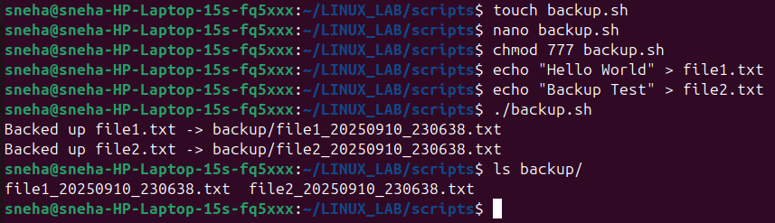

# LAB 4 – File & Backup Automation

## Aim  
To design a shell script that automatically creates backups of `.txt` files by saving them with a timestamp in a dedicated `backup/` folder.  

## Script Overview: `backup.sh`  
- Checks if a folder named `backup/` exists; if not, it creates one.  
- Scans the current working directory for all files ending with `.txt`.  
- Copies each file into `backup/` while appending the current timestamp to its filename.  
- Displays a completion message with the exact timestamp of the backup.  

## Demonstration  
```bash
$ touch notes.txt report.txt
$ ./backup.sh
Backup completed at 20240908_232900
$ ls backup/
notes_20240908_232900.txt  report_20240908_232900.txt
```

**Illustration:**  
  

## Step-by-Step Explanation  

### 1. Creating sample files  
```bash
$ touch notes.txt report.txt
```
➡ This command makes two empty files, `notes.txt` and `report.txt`. They serve as test files for the backup process.  

### 2. Running the backup script  
```bash
$ ./backup.sh
Backup completed at 20240908_232900
```
➡ When executed, the script:  
- Retrieves the current timestamp (`20240908_232900`).  
- Ensures the `backup/` folder exists (creates it if missing).  
- Copies all `.txt` files into `backup/`, renaming them with the timestamp suffix.  
- Prints a confirmation message once the process finishes.  

### 3. Verifying the backup  
```bash
$ ls backup/
notes_20240908_232900.txt  report_20240908_232900.txt
```
➡ Listing the contents of the `backup/` folder confirms that both files were copied successfully and renamed with the timestamp.  

## Additional Questions  

### Q1. Distinction between `cp`, `mv`, and `rsync`  

| Command | Purpose          | Key Point                                   |
|---------|-----------------|---------------------------------------------|
| `cp`    | Copies files    | Leaves the original file untouched          |
| `mv`    | Moves or renames| Original file is removed after the move     |
| `rsync` | Synchronizes    | Copies only changes, works locally & remotely |

### Q2. Automating backups with schedulers  

In Linux, we can use **cron jobs** to run scripts automatically at fixed times.  

```bash
crontab -e
# Example: Run script every day at 8 AM
0 8 * * * /path/to/backup.sh
```
