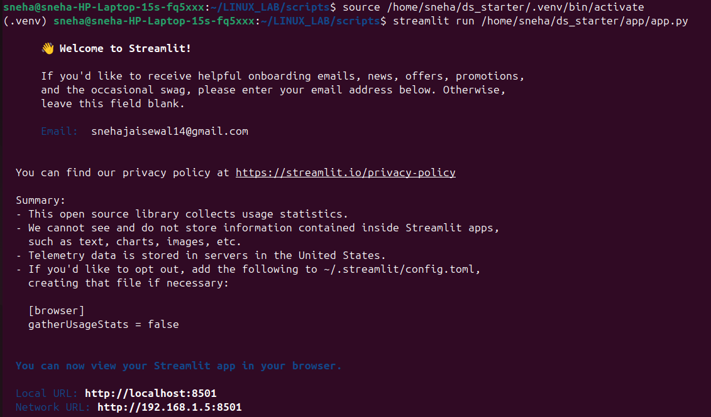
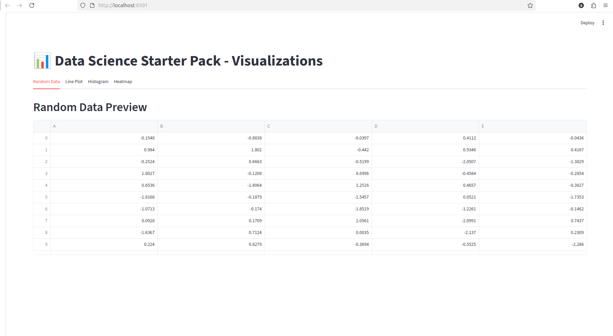

# LAB 5 – Starter Kit & Automation
## 🎯 Objective

- Automatically set up a starter project environment with a clean and organized folder structure and placeholder documentation.

## 🛠️ Purpose of starter_kit.sh

This script simplifies the initialization of a new project by:

- 📂 Creating a standard folder structure: scripts/, docs/, data/ inside a main project/ directory.

- 📝 Adding a README.md file in each folder to encourage documentation from the start.

- ✅ Printing a confirmation message once setup is complete.
## 🖥️ Example Run


## Directory Structure After Execution
```bash
project/
├── scripts/
│   └── README.md
├── docs/
│   └── README.md
└── data/
    └── README.md
```

## Screenshot Of The Browser Link:


## ❓ Extra Questions
**Q1.** What does mkdir -p do?

mkdir -p creates nested directories in a single command.

If the parent directory already exists, it does not throw an error.

Example:
mkdir -p project/scripts

This will create both project/ and scripts/ (if not already present).

**Q2.** Why is automation useful in DevOps?

🔁 Consistency → Same setup every time, reducing errors.

⚡ Speed → Saves time by eliminating repetitive manual tasks.

🧪 Reproducibility → Ensures environments can be easily recreated.

📦 Scalability → Easily sets up multiple environments or projects.